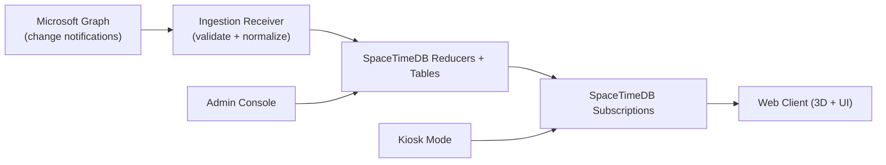
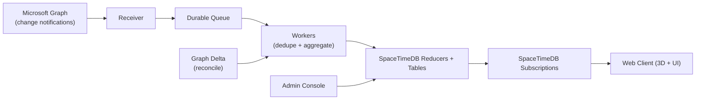
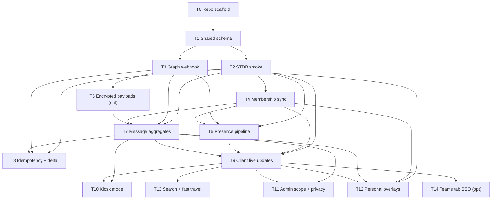

# Space365 - Implementation Plan (Blocking + Atomic)

- Doc version: 0.2 (draft)
- Date: 2026-02-05
- Source: `SPEC.md`
- Rule: No task may begin until all dependencies are completed and verified.
- Rule: Each POC is an atomic commit with passing tests.

## 1) Global constraints

- Use SpaceTimeDB subscriptions for real-time fanout; no custom WS layer.
- Use Microsoft Graph as source of truth; store only necessary metadata.
- Default to direct-to-reducer ingestion; add queue only if proven necessary.
- Tests are required for every POC and every integration step.
- A task is “verified” only when its tests pass and its deliverables are present.
- Test-first rule: write failing test(s) before implementation for each task (TDD by default).
- Atomicity rule: each task must include atomic tests + atomic code changes + atomic commit.
- Checkpoint rule: tag and/or branch `main` at least every 30 minutes during active work.

## 1.1) Data flow diagrams (minimal vs scale-up)

### Minimal path (no queue)


### Scale-up path (queue inserted only if needed)


## 1.2) Task dependency graph (T0–T14)


## 1.3) UI/UX wireframes (textual)

### World view (default)
```
┌────────────────────────────────────────────────────────────────────────────┐
│ Space365  [Search]  [Filters]  [Privacy/Data]  [Settings]                  │
├───────────────┬───────────────────────────────────────────┬───────────────┤
│ Activity Feed │                                           │ Room Details  │
│ - #support…   │               3D WORLD                    │ - Channel     │
│ - #design…    │         (zones, rooms, avatars)           │ - Metrics     │
│ - #ops…       │                                           │ - Open Teams  │
│               │                                           │ - Recent      │
├───────────────┴───────────────────────────────────────────┴───────────────┤
│ Minimap (heat)     [Fast Travel]     Status: Live / Stale                  │
└────────────────────────────────────────────────────────────────────────────┘
```

## 1.4) Agent-Safe Development Workflow

```bash
# ========================================
# STEP 1: Create Checkpoint Before Agent Work
# ========================================
git checkout main
git pull origin main

# Option A: Create a tag (recommended for main branch)
git tag -a checkpoint-$(date +%Y-%m-%d-%H%M) -m "Before agent session"
git push origin checkpoint-$(date +%Y-%m-%d-%H%M)

# Option B: Create a branch backup
git checkout -b main-backup-$(date +%Y-%m-%d) origin/main
git push origin main-backup-$(date +%Y-%m-%d)
git checkout main

# ========================================
# STEP 2: Agent Works on Feature Branch
# ========================================
# Agent creates PR and makes commits
# Review the PR carefully before merging

# ========================================
# STEP 3: Preserve Agent's Work (Optional)
# ========================================
# If you want to keep alternative implementations:
git fetch origin
git checkout -b agent-solution-preserved origin/agent-feature-branch
git push origin agent-solution-preserved

# ========================================
# STEP 4: After Successful Merge
# ========================================
git checkout main
git pull origin main

# Create stable checkpoint
git tag -a stable-$(date +%Y-%m-%d) -m "After successful agent PR merge"
git push origin stable-$(date +%Y-%m-%d)
```

### Room drill-down (selected channel)
```
┌────────────────────────────────────────────────────────────────────────────┐
│ Room: #support  |  Team: Customer Success  |  Last activity: 2m ago        │
├────────────────────────────────────────────────────────────────────────────┤
│ Metrics: 5m msgs=42  reacts=18  active≈9    |  Top threads (IDs only)       │
│ Glow: High (EMA)                              - thread:abc…                │
│                                                     thread:def…            │
│ [Open in Teams]  [Copy Link]  [Mute Room]                                   │
└────────────────────────────────────────────────────────────────────────────┘
```

### Admin console (scope + privacy)
```
┌────────────────────────────────────────────────────────────────────────────┐
│ Admin  |  Scope  |  Privacy  |  Retention  |  Health                        │
├────────────────────────────────────────────────────────────────────────────┤
│ Allowlist Teams/Channels                                                    │
│ [ ] Team A  [x] Team B  [x] Team C                                          │
│     └─ [x] #support  [ ] #private  [x] #announcements                       │
│                                                                            │
│ Privacy Toggles: [x] Presence  [x] Aggregates  [ ] Content-on-click         │
│ Safe Mode: [OFF]  |  Pause Ingest: [OFF]                                    │
└────────────────────────────────────────────────────────────────────────────┘
```

### Kiosk mode (shared display)
```
┌────────────────────────────────────────────────────────────────────────────┐
│ Space365 - Ambient View (Kiosk)                                             │
│                                                                            │
│                             3D WORLD                                       │
│                                                                            │
│  Status: Live     Next Camera Sweep: 00:25     QR: Open in Teams (optional) │
└────────────────────────────────────────────────────────────────────────────┘
```

## 2) Blocking prerequisites (external)

- Entra ID app registration created with required permissions.
- Tenant admin consent granted for Tier A/B (and Tier C/D if approved).
- Public HTTPS webhook endpoint reachable from Microsoft (required for change notifications).
- Teams app configuration (required only for T14).

These are hard blockers for Graph-related POCs; local-only POCs can proceed with simulated payloads.
Webhook-reliant tasks (T3, T5–T8, T12) require a public HTTPS endpoint.

## 3) Task list (ordered, blocking)

### Test-first checklist (apply to every task)
1. Define acceptance criteria in the task description.
2. Write failing tests that prove the criteria.
3. Run tests to confirm failure (red).
4. Implement minimal code to pass tests.
5. Re-run tests to confirm pass (green).
6. Commit: tests + code together as a single atomic commit.

### T0: Repo scaffolding and toolchain
- Purpose: establish monorepo structure and Bun tooling
- Depends on: none
- Blocks: all other tasks
- Deliverables: directories `/spacetime`, `/ingest`, `/web/client`, `/web/admin`, `/shared/types`
- Tests: `bun test` runs and reports (even if empty placeholder)
- Commit: `POC-0: repo scaffold`

### T1: Shared event schema and types
- Purpose: single source of truth for event payloads and IDs
- Depends on: T0
- Blocks: T2, T3, T4, T5, T6, T7, T8, T9, T10, T11, T12, T13, T14
- Deliverables: versioned event schema in `/shared/types`
- Tests: schema validation tests; `bun test`
- Commit: `POC-0.1: shared schema`

### T2: SpaceTimeDB module smoke test
- Purpose: verify reducers + subscriptions locally
- Depends on: T0, T1
- Blocks: T4, T6, T7, T8, T9, T10, T11, T12, T13, T14
- Deliverables: module tables + minimal reducers; auth stubs
- Tests: synthetic event inject -> subscription update within 1s
- Commit: `POC-1: STDB module smoke test`

### T3: Graph webhook validation (receiver only)
- Purpose: confirm validationToken + clientState workflow
- Depends on: T0, T1, Blocking prerequisites (Graph app + public HTTPS)
- Blocks: T5, T6, T7, T8, T12
- Deliverables: webhook receiver with validation handling
- Tests: simulated validation request + notification ACK < 10s (real Graph validation once endpoint is public)
- Commit: `POC-2: Graph webhook validation`

### T4: Membership sync pipeline
- Purpose: sync teams/channels + membership from Graph into SpaceTimeDB
- Depends on: T2, Blocking prerequisites (Graph app + admin consent)
- Blocks: T6, T7, T9, T11, T12
- Deliverables: membership sync + reconciliation (delta where available)
- Tests: Graph fixtures -> membership tables match; private channel non-leak test
- Commit: `POC-3: membership sync`

### T5: Encrypted resource data handling (optional)
- Purpose: decrypt Graph payloads if enabled
- Depends on: T3
- Blocks: T7
- Deliverables: decryption utility + discard-body path
- Tests: decrypt sample payload and persist metadata only
- Commit: `POC-4: encrypted resource data`

### T6: Presence subscription pipeline
- Purpose: presence change -> reducer -> subscription update
- Depends on: T2, T3, T4
- Blocks: T9
- Deliverables: presence ingestion path + reducer
- Tests: presence update visible in client within p50 < 10s
- Commit: `POC-5: presence pipeline`

### T7: Channel message metadata ingestion + aggregation
- Purpose: channel events -> aggregates -> room glow
- Depends on: T2, T3, T4, T5 (if encryption enabled)
- Blocks: T9, T10, T11, T12
- Deliverables: message event reducer + aggregate windows + EMA
- Tests: burst simulation -> bounded updates, accurate counts
- Commit: `POC-6: channel message aggregates`

### T8: Idempotency + replay + delta reconciliation
- Purpose: prove resilience to duplicates and missed events
- Depends on: T2, T3, T7
- Blocks: I3
- Deliverables: idempotency store + delta token handling
- Tests: shuffled replay ends in identical state; delta reconciliation matches expected totals
- Commit: `POC-7: idempotency`, `POC-8: delta reconciliation`

### T9: Client live rendering (world minimal)
- Purpose: STDB subscription -> UI change
- Depends on: T2, T4, T6, T7
- Blocks: T10, T11, T12, T13, T14
- Deliverables: client connects to STDB; room glow updates
- Tests: synthetic event updates visible within 1s; no frame drop under moderate load
- Commit: `POC-9: client live updates`

### T10: Kiosk mode
- Purpose: read-only ambient display for shared screens
- Depends on: T9, T7
- Blocks: T11
- Deliverables: kiosk mode toggle + restrictions
- Tests: kiosk cannot access personal overlays or deep links; 8h stability run
- Commit: `POC-10: kiosk mode`

### T11: Admin console scope + privacy + retention
- Purpose: allowlist/denylist and privacy toggles drive world state
- Depends on: T2, T7, T9
- Blocks: integration phase
- Deliverables: admin UI for allowlists, privacy toggles, retention settings + config reducer
- Tests: add/remove channel updates world within 60s; no private channel leakage
- Commit: `POC-11: admin scope + privacy`

### T12: Personal overlays (Phase 2)
- Purpose: mentions + meeting-soon quests (delegated, OBO proxy)
- Depends on: T3, T4, T7, T9
- Blocks: Phase 2 integration
- Deliverables: quest reducer + OBO proxy + opt-in UI
- Tests: quests visible only to owner; opt-out stops updates immediately
- Commit: `POC-12: personal overlays + OBO`

### T13: Search + fast travel (Phase 2)
- Purpose: find teams/channels/users and jump to location
- Depends on: T9
- Blocks: Phase 2 integration
- Deliverables: search UI + shareable location links
- Tests: search returns only authorized results; links do not leak private rooms
- Commit: `POC-13: search + fast travel`

### T14: Teams tab SSO (optional)
- Purpose: embedded Teams experience
- Depends on: T9, Blocking prerequisites (Teams app config)
- Blocks: none (optional)
- Deliverables: Teams tab manifest + SSO wiring
- Tests: Teams tab opens without additional login
- Commit: `POC-14: Teams tab SSO`

## 4) Integration phase (baby steps)

### I1: Integrate ingestion + STDB + client (no admin)
- Depends on: T2, T3, T4, T6, T7, T9 (and T5 if encryption is enabled)
- Blocks: I2, I3
- Tests: end-to-end synthetic activity shows in world and activity feed
- Commit: `INT-1: ingest + world integration`

### I2: Add admin controls
- Depends on: I1, T11
- Blocks: I3
- Tests: allowlist changes immediately affect world visibility
- Commit: `INT-2: admin integration`

### I3: Production hardening (minimal)
- Depends on: I2, T8
- Blocks: launch
- Tests: load test with target concurrency + SLO checks
- Commit: `INT-3: hardening`

### I4: Phase 2 integration (optional)
- Depends on: I2, T12, T13
- Blocks: Phase 2 release
- Tests: personal quests remain private; search links do not leak private rooms
- Commit: `INT-4: phase 2 integration`

## 5) Definition of done

- All POCs completed in order with atomic commits
- Tests pass for each POC and integration step
- Private channel non-leak verified
- SLOs met or documented with mitigations
- Tests were written first for each task and remain in the repo
