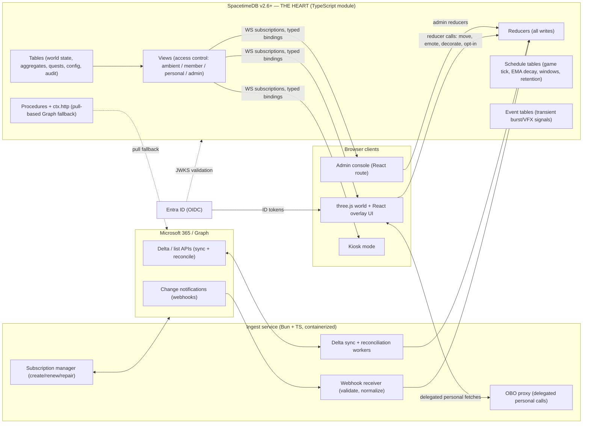

# Space365 — Master Plan v1.0 ("Minecraft meets the Office")

- Doc version: 1.0
- Date: 2026-07-06
- Supersedes: PLAN.md v0.2 (POC ladder T0–T14)
- Companions: `PRD.md` (product), `SPEC.md` (technical spec), `TASK_TRACKER.md` (live status),
  `docs/SPACETIMEDB/CAPABILITIES.md` (platform research), `docs/GRAPH_PERMISSIONS.md` (granted permissions inventory)

## 0) Honest baseline — where the project actually is

The v0.2 POC ladder (T0–T13) is marked DONE in the old tracker, but an audit on 2026-07-06 shows
those POCs were built as an **in-memory TypeScript simulation**. That work is not wasted — it is a
tested blueprint of the domain logic — but nothing yet runs on real infrastructure.

| Area | Reality |
|---|---|
| `spacetime/module/` | Domain logic (aggregates + EMA, membership gating, admin config, quests) as plain TS classes. **Zero SpacetimeDB bindings.** |
| `ingest/src/` | Webhook validation, credential parsing, OBO proxy (2 hardcoded routes), delta-cursor store. **No HTTP server, no Graph subscription lifecycle management.** |
| `web/client/` | Subscription-shaped logic wrappers, search/fast-travel, kiosk policy. **Zero rendering — no three.js, no HTML entry point.** |
| `web/admin/` | Empty. |
| `shared/types/` | Versioned canonical event schema v1 with validation + stable event IDs. **Good; keep.** |
| `tests/` | ~35 passing-by-design Bun tests mirroring the old ladder. **Become the parity suite for the real port.** |
| Toolchain | **Neither Bun nor the SpacetimeDB CLI is installed on this machine.** No node_modules, no CI, no Docker. |
| Azure app | Registered (`space365.tpgarchitecture.com`), 142 permissions consented. **Certificate credential verified working 2026-07-06** (wildcard cert assertion → token with 138 roles, `/teams` 200). Secret value in `.env` is stale — remove in P0.1; cert auth is the path. |
| Certs | Wildcard `*.tpgarchitecture.com` cert/key/CA bundle in `ssl_certs/` (plus www cert). |
| Hosting | `space365.tpgarchitecture.com` DNS/redirect URIs configured in the app registration; no server provisioned yet in this repo. |

### Day-0 blockers (require Bryan / tenant admin)

1. ~~Rotate the client secret~~ **RESOLVED 2026-07-06: certificate credential verified working.**
   Client-assertion auth with `ssl_certs/wildcard_tpgarchitecture.key` (thumbprint
   `40BFA7ABCC809A62E158C0C49F5597A321FEF944`, valid to 2027-01-16) acquires a token with all
   138 app roles; `GET /teams` returns 200. The secret value in `.env` remains stale — P0.1 is
   now just: switch `scripts/validate-graph-credentials.ts` and the ingest token client to
   certificate assertion and stop using `CLIENT_SECRET_VALUE`. Calendar reminder: cert renews
   Jan 2027 (second registered cert "TPG" is valid to 2027-03-16 as backup, but we do not hold
   its private key in this repo).
2. ~~Identify unknown consented API~~ **RESOLVED 2026-07-06:**
   `48d79017-a31f-47ce-ba88-03bbc843676f` = **TPGGraphAdmin**, an app registered in this tenant
   (custom app role). Confirm it's intentional; no action otherwise.
3. **Request the missing permissions** that the game needs (admin consent lead time — start now):
   - `Presence.Read.All` — avatars' live availability (the single highest-value gap; the PRD's Tier B).
   - `OnlineMeetings.Read.All` — meeting join links for portals.
   - Optional wave 2: `Files.Read.All`/`Sites.Read.All` (file "loot drops"), `Tasks.Read.All`
     (Planner quests), `Mail.Read` app-level is NOT recommended (privacy) — skip.
4. **Security review of over-granted permissions.** The app currently holds tenant-wide
   privilege-escalation-capable grants it does not need: `Application.ReadWrite.All`,
   `AppRoleAssignment.ReadWrite.All`, `Teamwork.Migrate.All`, `Chat.ReadWrite.All`, many
   `TeamsAppInstallation.ReadWrite*`. **Recommend pruning to read-only + `TeamsActivity.Send`.**
   This is both good hygiene and makes the privacy story credible.
5. **Confirm pilot hosting decision** (recommendation in §2.4: Maincloud free tier for dev/pilot,
   self-host Docker on the tpgarchitecture server for production).

## 1) Vision (updated 2026-07)

A browser-first, **playable MMORPG office world** that is simultaneously a **real operational GUI
for the entire Microsoft 365 surface we hold permissions for**. Users walk an avatar through a
voxel office campus where every building, room, portal, and NPC is live M365 data, and every
interaction deep-links back into the real tool. Fun enough to leave running; real enough to run
the office from.

Two modes stay from the PRD: **Ambient** (metadata-only, kiosk-safe) and **Personal** (opt-in,
server-enforced private overlays). Privacy-first defaults are non-negotiable and unchanged.

### The world, mapped to what we can actually build today (see `docs/GRAPH_PERMISSIONS.md`)

| World element | M365 data | Permissions we HOLD | Phase |
|---|---|---|---|
| Campus zones + rooms | Teams + channels structure | `Team.ReadBasic.All`, `Channel.ReadBasic.All`, `TeamSettings.Read.All` | P1–P2 |
| Room access / private rooms | Membership | `TeamMember.Read.All`, `ChannelMember.Read.All` | P1 |
| Room glow / heat / particles | Channel message metadata | `ChannelMessage.Read.All`, `ChatMessage.Read.All` | P1–P2 |
| Avatars (people) | Directory profiles | `User.Read.All`, `User.ReadBasic.All` | P3 |
| Avatar status (fallback) | Calendar busy state + chat recency | `Calendars.Read`, `Calendars.ReadBasic.All` | P3 |
| Avatar status (real presence) | Presence | **MISSING — request `Presence.Read.All`** | P3+ |
| Meeting portals | Calendar events | `Calendars.Read` (+`OnlineMeetings.Read.All` for join links — request) | P4 |
| Front desk / reception | Bookings | `Bookings.Read.All`, `BookingsAppointment.ReadWrite.All` | P4 |
| Comms Tower (call history viz) | Call records | `CallRecords.Read.All`, `CallEvents.Read.All` | P4 |
| Records Room (transcripts, admin-gated) | Call transcripts/recordings | `CallTranscripts.Read.All`, `CallRecordings.Read.All` | P4 (admin-only) |
| Security Wing (admin-only) | Audit logs | `AuditLog.Read.All`, `AuditLogsQuery.*` | P4 (admin-only) |
| Personal quest board | @mentions, meetings-soon | `Chat.Read.All`, `ChannelMessage.Read.All`, `Calendars.Read` (+delegated OBO) | P4 |
| Achievements → Teams notifications | Activity feed back-prop | `TeamsActivity.Send` | P5 |
| Town Hall banners | Org acronyms/bookmarks (Search answers) | `Acronym.Read.All`, `Bookmark.Read.All` | P5 (flavor) |
| Approvals desk | Approvals | `ApprovalSolution.Read.All` | P5+ (stretch) |

Explicitly **not represented** until permissions are granted: Mail, Files/SharePoint/OneDrive,
Planner, live Presence. The world design leaves reserved lots for them (see SPEC §layout).

## 2) Architecture (decided)

### 2.1 Diagram


```mermaid
flowchart LR
  subgraph M365["Microsoft 365 / Graph"]
    CN["Change notifications (webhooks)"]
    GD["Delta / list APIs (sync + reconcile)"]
  end

  subgraph INGEST["Ingest service (Bun + TS, containerized)"]
    WH["Webhook receiver (validate, normalize)"]
    SM["Subscription manager (create/renew/repair)"]
    DS["Delta sync + reconciliation workers"]
    OBO["OBO proxy (delegated personal calls)"]
  end

  subgraph STDB["SpacetimeDB v2.6+ — THE HEART (TypeScript module)"]
    RED["Reducers (all writes)"]
    TBL["Tables (world state, aggregates, quests, config, audit)"]
    VW["Views (access control: ambient / member / personal / admin)"]
    SCH["Schedule tables (game tick, EMA decay, windows, retention)"]
    EVT["Event tables (transient burst/VFX signals)"]
    PROC["Procedures + ctx.http (pull-based Graph fallback)"]
  end

  subgraph WEB["Browser clients"]
    GAME["three.js world + React overlay UI"]
    ADMIN["Admin console (React route)"]
    KIOSK["Kiosk mode"]
  end

  CN --> WH --> RED
  GD <--> DS --> RED
  SM <--> M365
  PROC -.pull fallback.-> M365
  TBL --> VW -->|WS subscriptions, typed bindings| GAME & ADMIN & KIOSK
  GAME -->|reducer calls: move, emote, decorate, opt-in| RED
  ADMIN -->|admin reducers| RED
  GAME <-->|delegated personal fetches| OBO
  ENTRA["Entra ID (OIDC)"] -->|ID tokens| GAME
  ENTRA -.JWKS validation.-> STDB
```

### 2.2 Decision log (with rationale)

| # | Decision | Choice | Rationale |
|---|---|---|---|
| D1 | SpacetimeDB module language | **TypeScript** | Stable since 2.0, fastest vendor benchmark (~304k TPS on V8), shared types with client/ingest, existing sim code ports nearly 1:1. |
| D2 | Access control | **Views, not RLS** | RLS still experimental with known subscription-join bugs; views are the officially recommended path. `AnonymousViewContext` for ambient world (cheap, shared), `ViewContext` for personal quests + member-gated rooms. |
| D3 | Game loop | **Schedule tables** | Transactional in-DB timers: window rollover, EMA decay, retention pruning, ambient events. No external cron for game logic. |
| D4 | Renderer | **three.js + React overlay (Vite)** | Browser-first requirement; TS SDK is the state layer and three.js renders from the client cache (officially supported pattern). Unity 6 WebGL remains a later option — same backend, no changes. Babylon.js acceptable fallback if we want built-in scene tooling. |
| D5 | Ingestion path | **External Bun service calling reducers via TS SDK over WebSocket** (service identity) | Graph webhooks need a public HTTPS receiver anyway; WS SDK is the optimized write path. Module **procedures + `ctx.http`** kept as pull-based reconciliation fallback. |
| D6 | Auth | **MSAL (browser) → Entra ID token → SpacetimeDB OIDC identity** | STDB accepts standard OIDC issuers (iss+sub → Identity). Entra acceptance is the P0 spike; fallbacks: SpacetimeAuth or a thin token-exchange service. Module validates tenant issuer in `client_connected`. |
| D7 | Hosting | **Maincloud free tier for dev/pilot; self-host Docker for prod** on tpgarchitecture infra behind Nginx + existing wildcard cert | Fastest start; prod self-host satisfies data-residency posture from the PRD. No self-host replication ⇒ snapshot backup runbook required. |
| D8 | Runtime/tooling | **Bun** (tests, ingest, scripts) + `spacetime` CLI | Matches existing repo choice; Bun is a supported STDB client runtime. |
| D9 | Message bodies | **Never stored in SpacetimeDB** (unchanged) | Metadata/counts only; content-on-click via delegated OBO fetch, ephemeral in client memory. |
| D10 | Multiplayer avatars | **Player positions are STDB tables** (the "real MMO" part) | Position/emote/decoration reducers + zone-scoped subscriptions (interest management); exactly the Blackholio/BitCraft pattern. |

### 2.3 The SpacetimeDB module is the product

Everything authoritative lives in one module (one database = one app, the BitCraft pattern):
world layout, org mirror (users/teams/channels/membership), activity aggregates, avatar
positions, quests, decorations, achievements, admin config, audit. The client is a renderer +
input device; the ingest service is a data feeder. Full table/reducer/view inventory: `SPEC.md §6–10`.

### 2.4 Environments

| Env | SpacetimeDB | Ingest | Web | Webhooks |
|---|---|---|---|---|
| dev (this Mac) | `spacetime start` local :3000 | `bun run dev` | Vite dev server | `cloudflared`/dev tunnel to local receiver |
| pilot | Maincloud (free tier) | container on tpg server | static hosting | `https://space365.tpgarchitecture.com/api/graph/webhook` |
| prod | self-host Docker on tpg server (RAM-sized) | same host | Nginx static + CDN | same |

## 3) Phase plan

Estimates assume one senior dev + AI pair, focused. Phases overlap where marked ∥.
Every task keeps the repo rules: test-first, atomic commits, tracker updated.

---

### P0 — Unblock & foundations (≈3–5 days)

Goal: real toolchain, real credentials, real SpacetimeDB running, auth spike answered.

| ID | Task | Acceptance |
|---|---|---|
| P0.1 | Fix Graph credential (Day-0 #1; prefer certificate credential) | `bun run graph:validate-credentials` returns 200 from `/teams` |
| P0.2 | Install toolchain: Bun, SpacetimeDB CLI; `bun install`; existing tests green | `bun test` passes locally; `spacetime version` works |
| P0.3 | Hello-STDB: publish a minimal TS module locally; typed bindings via `spacetime generate`; browser page subscribes and sees a live row update | update visible <1s |
| P0.4 | **Entra OIDC spike (D6)**: MSAL sign-in → ID token → `DbConnection.withToken()` → identity accepted; module logs verified iss/sub | Entra-issued identity connects, or fallback (SpacetimeAuth / token-exchange) selected and documented |
| P0.5 | CI: GitHub Actions — bun test + module typecheck/publish to ephemeral local server | green pipeline on PR |
| P0.6 | File permission requests + pruning proposal (Day-0 #3/#4) with tenant admin | requests submitted; tracked in TASK_TRACKER |

**Exit gate:** real module published locally; Entra auth path decided; Graph credentials valid.

---

### P1 — Real SpacetimeDB core: port the simulation (≈2 weeks)

Goal: the in-memory blueprint becomes real tables/reducers/views; ingest feeds it with real Graph data.

| ID | Task | Notes |
|---|---|---|
| P1.1 | Schema: `users`, `teams`, `channels`, `team_members`, `channel_members`, `room_state`, `activity_events`(short retention), `channel_activity_agg`, `quests`, `config`, `audit_log`, `graph_cursors`, `ingest_dedup` + indexes | port from `shared/types` + sim |
| P1.2 | Reducers: `upsert_user/team/channel`, `sync_membership`, `ingest_channel_message_event`, `ingest_presence` (schema-ready even while permission missing), `create_or_update_quest`, `admin_update_config`, dedup inside transaction | idempotency: stable event_id unique-constraint insert |
| P1.3 | Schedule tables: 1m/5m/1h window rollover, EMA glow decay tick, retention pruning | glow decays with no traffic |
| P1.4 | Views: `ambient_world` (anonymous), `member_rooms` (per-identity), `my_quests` (per-identity), `admin_ops` (role-gated); tenant-issuer validation in `client_connected` | privacy tests: non-member sees no private channel row, quest isolation |
| P1.5 | Parity test harness: drive published module via TS SDK against local server; port the 35 sim tests | old sim deleted once parity green |
| P1.6 | Ingest v1: real HTTP server (Bun.serve) — webhook receiver (validationToken/clientState), **subscription manager** (create/renew/repair loop, health table in STDB), initial full sync (teams/channels/members/users), delta reconcile workers, SDK connection with service identity | end-to-end: real Teams message → room_state change |
| P1.7 | Public webhook endpoint: dev tunnel now; provision `space365.tpgarchitecture.com` receiver path (Nginx + wildcard cert) | Graph subscription validates against public URL (closes old P-3) |

**Exit gate:** a message posted in an allowlisted Teams channel updates `room_state` in SpacetimeDB
within SLO (p50 <3s), survives replay/duplicates, leaks nothing private. **The heart is beating.**

---

### P2 — World client MVP: see the office (≈3 weeks, ∥ P1 tail)

Goal: the browser world exists — walkable camera, live rooms, real data.

| ID | Task |
|---|---|
| P2.1 | Vite + three.js + React scaffold in `web/client`; STDB typed bindings; connection/status HUD (Live/Stale) |
| P2.2 | Deterministic layout lib in `shared/` (hash → zone grid slot, open addressing, layout version in `config`) — same code usable by module + client |
| P2.3 | Voxel campus renderer: plaza hub, team zones (color + landmark), channel rooms with signage; instanced meshes, chunked loading |
| P2.4 | Live activity: room glow/emissive from `channel_activity_agg` EMA; burst particles from event-table signals; minimap heat |
| P2.5 | Overlay UI: activity feed (filters, deep links "Open in Teams"), room drill-down panel (counts, top thread IDs, last activity), search + fast travel, privacy/data page |
| P2.6 | MSAL sign-in flow wired to P0.4 decision; anonymous mode rejected outside dev |
| P2.7 | Kiosk mode: `?kiosk=1` + kiosk identity — read-only, no personal overlays, no deep links, idle camera sweep |
| P2.8 | Perf pass: 60fps @ medium on M-series/modern laptop, reduced-motion mode, colorblind-safe heat palette |

**Exit gate:** demo: open browser → sign in → fly through live office → watch a real channel light
up when someone posts. Kiosk runs 8h.

---

### P3 — Avatars & multiplayer: make it inhabited (≈2 weeks)

Goal: it stops being a dashboard and starts being a game.

| ID | Task |
|---|---|
| P3.1 | Directory sync: all tenant users → `users` table (profile, dept, title, avatar_seed) |
| P3.2 | `player_state` table (position, heading, animation, zone) + `move_player`/`set_emote` reducers; client-side prediction + interpolation; zone-scoped subscription (interest management) |
| P3.3 | Avatar renderer: low-poly characters, name plates (policy-gated), simple walk/idle animations, emote wheel |
| P3.4 | Status ring (fallback while Presence permission pending): calendar busy-state + chat-activity recency → Available/Busy/In-meeting approximation, clearly labeled "approximate" |
| P3.5 | Presence pipeline behind feature flag: subscription + reducer ready; flips on the day `Presence.Read.All` is consented |
| P3.6 | Multi-client soak: 20+ simulated moving clients, no jank; STDB energy/throughput measured |

**Exit gate:** two browsers see each other walk and emote in <150ms perceived; the office feels alive.

---

### P4 — Full permitted M365 surface (≈3 weeks, ∥ P3)

Goal: every workload we hold read permissions for is represented and actionable.

| ID | Task |
|---|---|
| P4.1 | Meeting portals: calendar sync (org mailboxes in allowlist) → portal objects near zones; "starting soon" pulse; join deep link (upgrade when `OnlineMeetings.Read.All` lands) |
| P4.2 | Personal quests: mentions + meeting-soon via delegated OBO proxy (generalize `graph_proxy.ts` route table); quest board object + private overlay via `my_quests` view; opt-in UI; safe-mode kill |
| P4.3 | Front Desk: Bookings businesses/appointments → reception counter viz (today's bookings ticker) |
| P4.4 | Comms Tower: `CallRecords` → historical call/meeting volume visualization (aggregate art: light beams by hour); PSTN stats admin-gated |
| P4.5 | Records Room (admin-only view): call transcripts/recordings **metadata** listing with deep links — never content in STDB |
| P4.6 | Security Wing (admin-only view): audit log query visualization (sign-ins, admin actions ticker); powered by `AuditLogsQuery.*` |
| P4.7 | Admin console (React route, `web/admin` merged into client repo): allowlists, signal toggles, retention, subscription health board, safe mode, pause ingest — all via admin reducers + `admin_ops` view |
| P4.8 | Transparency page: live "what we collect" driven from actual `config` + granted-permission list |

**Exit gate:** admin can scope the world without redeploys; every enabled workload visible in-world
with a deep link; privacy suite (non-leak, quest isolation, kiosk restrictions) green.

---

### P5 — Playable & fun (≈2 weeks)

Goal: people *want* to leave it open. Team-level fun only — no individual scoring (PRD principle).

| ID | Task |
|---|---|
| P5.1 | Achievements (team-level): weekly aggregates → banners/statues in zones; optional `TeamsActivity.Send` back-prop (off by default, rate-limited) |
| P5.2 | Office decoration: users place voxel props in their zone (STDB `decorations` table, budget-limited per user) — the "Minecraft" hook |
| P5.3 | Ambient life: day/night matched to office hours, weather by "org mood" (activity level), birds/coffee steam idle VFX |
| P5.4 | Onboarding: first-run tour quest ("find your team's zone"), controls help, dashboard-mode toggle for the game-averse |
| P5.5 | Sound design (subtle, default-muted ambient) |

---

### P6 — Hardening & ship (≈2 weeks)

| ID | Task |
|---|---|
| P6.1 | Load: burst-message replay at 500 msgs/min across 200 channels; 100 concurrent clients; SLO report (p50 <3s event-to-visual, p95 <10s) |
| P6.2 | Chaos: kill ingest mid-burst → delta reconcile recovers; STDB restart → commitlog replay verified; stale-mode UI badge |
| P6.3 | Prod deploy: Docker on tpg server (STDB self-host + ingest + Nginx static client) with wildcard cert; `spacetime lock` on prod DB; systemd units; runbook |
| P6.4 | Backups: nightly data-volume snapshot + restore drill documented |
| P6.5 | Observability: ingest metrics (latency, renewal failures, throttling), STDB energy/log monitoring, uptime alerts |
| P6.6 | Security & privacy sign-off: permission prune executed (Day-0 #4), secret→certificate migration, logs-redaction audit, retention enforcement verified |
| P6.7 | Pilot rollout: allowlist 3–5 teams, kiosk in office, feedback loop; success metrics wired (PRD §17) |

**Definition of shipped:** pilot users sign in daily, kiosk runs unattended, all privacy tests
green in CI, SLOs met or documented, admin can operate without engineering.

---

## 4) Sequencing & critical path

```
P0 ──► P1 ──► P2 ──► P3 ──► P5 ──► P6
              └────► P4 ────────┘        (P4 ∥ P3, both feed P5)
Permission requests (P0.6) run in parallel; Presence flag flips whenever consent lands.
```

Critical path: **P0.1 (credentials) → P0.4 (Entra↔STDB auth) → P1 (real module) → P2 (renderer)**.
The two technical unknowns are front-loaded: Entra OIDC acceptance (P0.4) and webhook-at-public-URL
(P1.7). Everything after is well-trodden ground per the platform research.

## 5) Testing (carried forward, upgraded)

- Test-first + atomic commits remain the law of the repo.
- The 35 sim tests become the **parity suite** against the real module (P1.5); sim code is then deleted.
- New suites: privacy non-leak (blocking, runs in CI), webhook replay/idempotency, load (P6.1),
  visual smoke (screenshot of rendered world in CI via headless WebGL).
- Every phase exit gate is an executable test or scripted demo, not a claim.

## 6) Risks

| Risk | Likelihood | Mitigation |
|---|---|---|
| Entra OIDC not accepted by STDB JWKS validation | Medium | P0.4 spike day one; fallbacks: SpacetimeAuth, thin token-exchange service |
| Presence permission not granted | Medium | P3.4 calendar/activity fallback ships regardless; flagged pipeline ready |
| STDB RAM growth (all-in-memory) | Low–Med | metadata-only policy, retention pruning schedule, aggregate-first tables; measure in P3.6 |
| Per-identity views expensive at scale | Medium | personal views limited to quests; ambient world is one anonymous view |
| Graph throttling on tenant-wide message subscriptions | Medium | allowlist scope, `getAllMessages` only if approved, delta reconcile as safety net |
| Perception of surveillance | High-impact | PRD ethics section enforced: metadata-only, opt-in personal mode, transparency page, permission prune (Day-0 #4), no individual metrics anywhere |
| Solo-dev scope creep | High | phase exit gates are hard; P5 fun items are cuttable; P4 items independently shippable |

## 7) Estimate summary

| Phase | Duration | Cumulative |
|---|---|---|
| P0 Unblock & foundations | 3–5 days | week 1 |
| P1 Real STDB core | 2 wks | week 3 |
| P2 World client MVP | 3 wks (∥) | week 5–6 |
| P3 Avatars & multiplayer | 2 wks | week 7–8 |
| P4 Full M365 surface | 3 wks (∥ P3) | week 9–10 |
| P5 Playable & fun | 2 wks | week 11–12 |
| P6 Hardening & ship | 2 wks | **week 13–14** |

~3.5 months solo to a shipped pilot; a second contributor on P4 (data surfaces) while one owns
P2/P3 (game) compresses to ~2.5 months.
