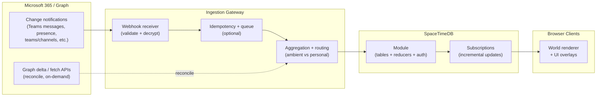

# Space365 (“Minecraft meets Teams”) — Product Requirements Document (PRD)

- **Doc version:** 0.4 (draft)
- **Date:** 2026-02-05
- **Status:** Draft (foundational)
- **Primary deliverable:** This PRD is the input to `SPEC.md`
- **Owner:** TBD
- **Stakeholders:** IT/Security, HR/Legal, Design, Engineering, Team leads
- **Target surfaces:** Browser web app (desktop-first); optional Teams tab; optional kiosk display

> **Ethics & trust (non‑negotiable):** Space365 visualizes workplace collaboration signals. It must be **privacy-first**, **transparent**, and **configurable**. The default experience must avoid exposing message content and must not become a surveillance tool.

## 1) Executive summary

Space365 is a browser-based, MMORPG-style, real-time visualization of Microsoft 365 activity—**heavily centered on Microsoft Teams**—rendered as a living “office world.”

It is best understood as a sophisticated, real-time office dashboard that uses a game metaphor:
- **Teams** → places you can walk to (zones/rooms)
- **Activity** → ambient world effects (glow, particles, density)
- **Presence/meetings** → avatar states and world events
- **Mentions/tasks** → personal “quests”

Space365 is powered by:
- **SpaceTimeDB** as the authoritative real-time state engine (tables + reducers + live subscriptions).
- **Microsoft Graph** as the source of truth for Teams signals (messages, channels, presence, meetings, etc.).

## 2) Background / problem statement

Teams is information-dense and timeline-based. It’s excellent for participating, but harder for:
- understanding **where** activity is happening across the office
- catching **bursts** of important context without reading everything
- maintaining **ambient awareness** without notification overload

Space365 aims to make the office’s collaboration “shape” legible at a glance—without reading private content—so employees can:
- spot where activity is spiking
- find the right channel to join
- see meeting rhythms
- quickly jump into the relevant thread in Teams

## 3) Goals and non-goals

### Goals
- **Ambient, real-time** view of office-wide Teams activity with seconds-level freshness for supported signals.
- A **shared world** accessible in any modern browser (and optionally embedded as a Teams tab).
- **Actionable visualizations**: every signal includes a way to open the underlying Teams context.
- **Privacy-first defaults**, with explicit admin/user opt-ins for any more sensitive features.
- **Scalable** to office-wide usage (hundreds–low-thousands of clients; configurable scope).

### Non-goals (v1)
- Replacing Teams chat/meetings.
- Mirroring full Teams content (bodies, attachments) into SpaceTimeDB.
- Individual performance scoring, “leaderboards,” time-tracking, or covert monitoring.
- Mandatory participation: the product must support opt-out / reduced-visibility modes.

## 4) Guiding principles

1. **Metadata first**
   - Prefer counts, timestamps, IDs, and coarse summaries over content.
2. **Consent and scope**
   - Personal overlays are opt-in; org-wide ingestion is allowlisted and configurable.
3. **Actionability**
   - Every visual element must link back to the real source in M365.
4. **Ambient > addictive**
   - The experience should inform, not distract; “dashboard mode” always available.
5. **Deterministic, testable world state**
   - SpaceTimeDB reducers define truth; clients render and interact.
6. **No individual scoring**
   - Any gamification is team-level and opt-in; avoid per-person productivity metrics.

## 5) Personas

### P1: Employee (primary)
- Wants to see “what’s happening” and jump in quickly.
- Wants personal mentions/meetings surfaced privately.
- Wants strong controls and an opt-out.

### P2: Team lead / manager
- Wants a “command center” for team momentum and cross-team collaboration hotspots.
- Wants aggregate signals, not individual surveillance.

### P3: IT / security admin
- Needs least-privilege permissions, auditability, retention controls, and incident response knobs.
- Needs confidence the app won’t leak chat content or violate policy.

## 6) Product concept: the world

### World mapping
- **Zone** = a Teams *Team* (or department grouping)
- **Room / building** = a Teams *channel*
- **Avatar** = a user (presence-aware)
- **Ambient effects** = activity signals (message bursts, reactions, meeting portals)
- **Quest board** = actionable personal items (mentions, meeting soon, tasks)

### Two operating modes
1. **Ambient Mode (default)**
   - Office-wide, privacy-safe, metadata-only
   - Suitable for shared displays (lobbies, all-hands rooms)
2. **Personal Mode (opt-in)**
   - Overlays private signals relevant to the signed-in user only
   - Never visible to other users

## 7) Scope definition: what “office activity” means

**In-scope (Teams-heavy)**
- Team/channel structure and membership (for world layout and access)
- Presence (availability/activity)
- Channel message events (new/edit/delete + reaction changes) as *metadata*
- Mentions in channel messages (personal overlay)
- Meetings (calendar/online meeting metadata, “starting soon”)

**Later / optional**
- Chats (group/1:1) — only with explicit opt-in and careful access controls
- Files shared (SharePoint/OneDrive metadata)
- Call records and meeting artifacts (transcripts/recordings) — admin-only, on-demand
- Tasks (Planner/To Do) — “quests”

## 8) Data signals and how they “bring the game to life”

### Signal inventory (Teams-first)

**Privacy classes**
- **Public metadata:** safe to show broadly (counts, channel name, activity intensity)
- **Team-scoped:** show only to members of that Team/channel (configurable)
- **Personal/private:** only visible to the signed-in user
- **Admin restricted:** IT/admin only; not shown in the world by default

| Signal | Graph resource(s) | Event delivery | Space365 representation | Default privacy |
|---|---|---|---|---|
| Teams + channels | `teams`, `channels` | Scheduled sync + change notifications | World zones + rooms | Public metadata |
| Membership | `team/members`, `channel/members` | Scheduled sync (initial) | Access control + avatar grouping | Team-scoped |
| Channel messages (new) | `chatMessage` (channel) | Change notifications + delta reconcile | Room glow, particles, activity feed item | Public metadata (no body) |
| Channel messages (update/delete) | `chatMessage` updates | Change notifications | Fade/glitch effects; decrement counters | Public metadata |
| Reactions | `chatMessage` reactions | Change notifications | Emoji burst, sparkles | Public metadata |
| Mentions (@user) | `chatMessage` mentions | Change notifications → route | Personal quest ping + marker | Personal/private |
| Presence | `communications/presences` | Change notifications + reconcile | Avatar animation/state | Configurable (often public-ish) |
| Meetings (soon/start) | `events`, `onlineMeetings` | Calendar subscriptions + polling | “Portal” opens near zone; timeline item | Personal by default |
| Call records (after) | `communications/callRecords` | Change notifications | Optional recap analytics | Admin restricted |

### Event-to-world mapping (examples)
- **A burst of messages in #support** → that room’s light intensifies, subtle “soundless” particles appear.
- **A reaction storm** → quick emoji sprites above the room.
- **A new thread with many replies** → “campfire” effect near a quest board in that room.
- **Your @mention** → your avatar gets a private “ping,” minimap marker, and a quest card with a deep link.
- **Meeting starting in 5 minutes** → a portal appears in your team’s zone; clicking opens meeting join link.

## 9) Privacy, governance, and trust requirements (foundational)

### Default data minimization rules
**Store in SpaceTimeDB (default)**
- IDs (team/channel/message), timestamps
- counts/aggregates per channel per time window
- presence availability/activity (if allowed)
- mention targets (user IDs) for personal quests
- deep links (URLs) to open context in Teams

**Do not store in SpaceTimeDB (default)**
- message bodies
- attachments or hosted content
- private chat content (unless explicit opt-in + scoped)

**If content is ever displayed**
- Fetch on demand from Microsoft Graph using the viewer’s delegated token.
- Do not persist the body beyond short-lived client memory unless explicitly approved.

### Visibility and access rules (hard requirements)
- **Private channels:** must never reveal existence, name, membership, or activity to non-members (enforced server-side).
- **Non-member access:** for teams/channels the viewer cannot access, the default policy is **hide entirely** (configurable to “anonymized/locked area” with explicit admin enablement).
- **Presence:** configurable granularity. Default is coarse state only (Available/Away/Busy/In a meeting) and never implies “where” a person is in the world unless explicitly enabled.
- **Personal overlays:** always private and enforced server-side (no client-only filtering).

### Roles and access model
- **Admin (IT/Sec):** manage scope (allowlists), privacy toggles, retention, safe mode, and operational controls.
- **User:** view world within policy; opt in/out of personal overlays.
- **Kiosk (optional):** read-only ambient display account; deep links and personal overlays disabled; restricted scope.

Role assignment and authorization:
- Roles map to Microsoft Entra ID groups/claims.
- SpaceTimeDB must enforce role and visibility checks on reducers and subscriptions.

### Data classification (recommended)
| Data category | Examples | Default handling |
|---|---|---|
| World config | layout, thresholds | Low sensitivity; safe to share broadly |
| Org metadata | team/channel names | Medium; may be sensitive depending on tenant policy |
| User metadata | display name, title | PII; minimize and follow policy |
| Presence | availability/activity | Policy-dependent; coarse by default |
| Message metadata | timestamps, author IDs, thread IDs | High; store minimal, avoid logs, short retention |
| Content | message bodies, files | Very high; off by default, fetch-on-click only |

### Transparency requirements
In-app “Data & permissions” page must show:
- Which Graph permissions are granted (and why)
- Which teams/channels are included (allowlist)
- Whether any content is stored (default: no)
- Retention settings
- How to opt out / reduce visibility

### Admin controls (minimum)
- Allowlist/denylist teams and channels (with import from AAD groups if desired).
- Toggle each signal type (presence on/off, message metadata on/off, etc.).
- Configure display rules (e.g., hide authors, hide presence granularity).
- “Safe mode” (kills personal overlays and content fetch features).
- Retention controls (e.g., keep only 30 days of aggregates).
- Kill switch: pause ingestion + freeze world.

### Auditability
Log (and optionally export) records of:
- Admin config changes
- Graph subscription create/renew/delete events
- Any “content fetch” events (if enabled) without logging the content itself

## 10) Functional requirements (detailed)

### FR-1: Authentication & identity
- Support Microsoft Entra ID sign-in (OIDC/OAuth).
- Map signed-in users to SpaceTimeDB identity via OIDC JWT (issuer+subject).
- Support:
  - Standard web sign-in
  - Optional Teams tab SSO (later phase)

**Acceptance criteria**
- A user can sign in with their Microsoft 365 identity.
- SpaceTimeDB recognizes the user identity consistently across sessions.

### FR-2: MMORPG-quality world rendering (browser)
- 3D world rendered in browser (WebGL/WebGPU-ready).
- Art style: voxel / low-poly, “Minecraft meets modern UI,” enterprise-safe.
- Camera:
  - default: angled third-person or isometric
  - fast travel: jump to team/channel locations
- Movement:
  - keyboard + mouse
  - click-to-move optional (accessibility)
- **World generation (deterministic layout):**
  - Team zones and channel rooms are generated from allowlisted Teams structure.
  - Layout must be stable across sessions and clients (deterministic mapping from IDs → coordinates).
  - New teams/channels should be placed without reshuffling existing geography.
  - Admins can optionally pin/override positions and labels (e.g., rename landmarks).
- **Avatar semantics (privacy-safe):**
  - Avatar location represents where a user is in Space365 (user-controlled), not which Teams content they are reading.
  - Any “auto-location” driven by Teams activity must be personal-only (never broadcast), and off by default.

**Acceptance criteria**
- 60fps on modern hardware at medium settings in typical scene density.
- Reduced motion mode is available and respected.
- Reloading the world preserves the same zone/room locations for the same allowlist.
- A user’s avatar location cannot be used to infer what channel/thread they are viewing in Teams.

### FR-3: Real-time activity visualization (Teams-heavy)
- Real-time channel activity effects:
  - room glow intensity based on rolling message/reaction rate (configurable windows + smoothing)
  - burst VFX on new threads or spikes
  - optional per-team “heat” overlay on minimap
- Activity feed panel:
  - filter by team/channel
  - show safe metadata (time, team/channel, event type; author optional and policy-gated)
  - “Open in Teams” deep link for each item
- **Aggregation-first at scale:**
  - The default visualization uses aggregates (counts/heat) rather than broadcasting every raw event to every client.
  - The system must support rate limiting/sampling of feed items during bursts while keeping heatmaps accurate.

**Acceptance criteria**
- A new message in an allowlisted channel is reflected in the world within the NFR latency target.
- No message body is displayed in ambient mode by default.
- Under bursty load, clients remain responsive and receive bounded update rates (no unbounded per-message fanout).

### FR-4: Personal overlays (“quests”)
- Private quest cards for:
  - @mentions
  - meeting starting soon
  - optional: tasks (later)
- Quest card must include:
  - source (channel/team)
  - time
  - deep link to open the item in Teams/Outlook
- Quests are visible only to the signed-in user (enforced server-side).
- Users must have an in-app control to opt in/out of personal overlays (default off unless org policy dictates otherwise).

**Acceptance criteria**
- Another user cannot observe or infer your quest list from shared world state.
- A user can disable personal overlays and immediately stop receiving quest updates.

### FR-5: Drill-down without content leakage
- Clicking a room shows:
  - rolling counts (messages, unique authors estimate)
  - “top active threads” by activity count (IDs only unless enabled)
  - last activity time
- “Open in Teams” always takes the user to the source of truth.
- If the viewer lacks access to a team/channel, the room must be hidden or rendered as “restricted” per the configured visibility policy, without leaking names or activity.

### FR-6: Admin configuration console
Admin UI to manage:
- allowlists / scope
- signal toggles + privacy options
- retention + aggregation windows
- operational status (webhook health, backlog, subscription renewal)
- incident actions (pause ingestion, safe mode)

**Acceptance criteria**
- Admin can add/remove a team/channel from scope and see world changes without redeploying.
- Safe mode immediately disables personal overlays and any content-fetch features.
- Subscription health clearly indicates “active / expiring soon / failed” and provides operator guidance.

### FR-7: Optional back-propagation into Teams
If enabled, Space365 can send Teams activity feed notifications for:
- team-level milestones (e.g., “Support zone hit 100 helpful answers this week”)
- onboarding reminders (“your zone is here”)

Must be off by default and rate-limited to avoid spam.

### FR-8: Observability
Minimum dashboards:
- ingestion latency (Graph → SpaceTimeDB reducer → client render)
- webhook failure rate / retries
- Graph throttling events
- active client count
- SpaceTimeDB reducer throughput + subscription fanout

**Acceptance criteria**
- Operators can detect webhook/subscription failures within minutes via alerts.
- Logs and traces are redacted to avoid leaking message content by default.

### FR-9: Navigation, search, and shareability
- Search across allowlisted:
  - teams/zones
  - channels/rooms
  - users (policy-gated; optionally limited to display name only)
- Fast travel:
  - jump to a team/channel location from search results
  - “recent places” and favorites (local-only by default)
- Shareability:
  - generate a shareable “location link” that opens Space365 focused on a room (without leaking restricted info)

**Acceptance criteria**
- A user can search for a channel and teleport to its room in under 2 seconds (excluding initial load).
- Shared links never reveal private or unauthorized team/channel names to non-members.

### FR-10: Kiosk / shared-screen mode
- Provide a kiosk mode intended for lobby/all-hands displays:
  - read-only, minimal UI
  - no personal overlays
  - deep links disabled by default (optional QR-based linking)
  - configurable rotation/camera idle behavior

**Acceptance criteria**
- Kiosk mode can run unattended for a full business day without user interaction.
- Kiosk mode cannot display personal quests or content-on-click features.

### FR-11: Teams tab embedding (optional, Phase 2+)
- Package Space365 as an optional Teams app tab:
  - supports Teams tab SSO
  - uses Teams-first deep links when embedded

**Acceptance criteria**
- A signed-in Teams user can open the Space365 tab without an additional login prompt in typical enterprise configurations.

## 11) Non-functional requirements (NFRs)

### Latency targets
- **Event-to-visual latency:** p50 < 3s, p95 < 10s for subscription-backed signals.
- **Presence update latency:** p50 < 10s (presence can vary by Graph behavior).

### Scale targets (initial assumptions; validate)
- Eligible users: 50–2,000
- Concurrent clients: 50–500 (pilot), 1,000+ (future)
- Included channels: 5–200 (allowlisted)
- Message volume: 1–500 msgs/min across included channels

### Reliability
- Business-hours availability: 99.9%
- Graceful degradation when webhooks fail:
  - show stale badge
  - switch to delta/poll-based reconciliation at reduced frequency

### Security
- Secrets stored in managed secret store (Azure Key Vault or equivalent).
- Webhook endpoint is HTTPS with robust validation.
- Least-privilege Graph permissions; admin consent required where applicable.
- Strict authorization boundaries inside SpaceTimeDB for personal overlays.

### Retention
- Default retention:
  - raw event metadata: 7–30 days
  - aggregates: 90 days (configurable)
- Hard requirement: retention must be configurable and documented.

## 12) Technical architecture (recommended)

### High-level components
1. **Web client (Game)**
   - Babylon.js (3D) + React (UI overlays)
   - Connects to SpaceTimeDB via WebSocket
   - Uses Entra ID login (MSAL)
2. **SpaceTimeDB (authoritative world state)**
   - Module defines tables + reducers
   - Clients subscribe to queries for live updates
   - Identity mapped from OIDC JWT
3. **Graph ingestion gateway**
   - Receives Graph change notifications (webhooks)
   - Validates + decrypts (if using encrypted resource data)
   - Normalizes, deduplicates, aggregates
   - Invokes SpaceTimeDB reducers as a trusted service client
4. **Admin console**
   - Configure scope, privacy, and operations
5. **Telemetry**
   - Logs/metrics/traces (OpenTelemetry)

### Data flow diagram (mermaid)

### Ingestion reliability and backpressure (recommended)
- Webhook handler must acknowledge quickly and do minimal work synchronously; processing should be async.
- Recommended pattern:
  - **Receiver**: validates + enqueues notification payloads
  - **Workers**: dedupe, fetch any needed metadata, aggregate, and invoke SpaceTimeDB reducers
- Use a durable queue (e.g., Azure Service Bus / Storage Queue) to smooth bursts and survive downstream outages.
- Idempotency requirements:
  - Notifications may be duplicated or arrive out of order.
  - Ingestion must compute stable idempotency keys and keep a short-lived “seen” store.
  - Delta reconciliation must exist to recover from missed notifications.
- Subscription lifecycle:
  - a renewal job runs continuously and renews before expiration
  - lifecycle failures page an operator and flip the world into “stale” mode with clear UI messaging

### SpaceTimeDB Cloud vs self-host (decision guidance)
**Pilot (fastest path):** SpaceTimeDB Cloud for speed and iteration.

**Production:** strongly consider Azure self-host if your policy requires:
- region residency / private networking
- internal-only hosting of collaboration metadata
- stronger operational control (backups, retention enforcement, incident response)

PRD assumption: **use Cloud for pilot**, maintain a migration plan to **Azure-hosted SpaceTimeDB** before broad rollout.

### Recommended tech stack
- **SpaceTimeDB module:** TypeScript (fast iteration; shared types with client)
- **Ingestion gateway:** Node.js + TypeScript (containerized)
- **Web client:** TypeScript + React + Babylon.js + Vite
- **Auth:** MSAL (browser), Entra ID app registration
- **Hosting:** Azure Container Apps (webhooks/admin), static hosting for client
- **Telemetry:** OpenTelemetry + App Insights

## 13) SpaceTimeDB design (world state)

### Why SpaceTimeDB
SpaceTimeDB provides:
- authoritative shared state (game-server-like)
- relational tables mutated by reducers
- real-time subscriptions for incremental client updates
- OIDC/JWT-based identity + authorization primitives

### Proposed tables (initial schema sketch)
**Org/world**
- `users` — `user_id`, `display_name`, `dept`, `title`, `avatar_seed`, `opt_in_personal`
- `teams` — `team_id`, `name`, `zone_id`, `is_enabled`
- `channels` — `channel_id`, `team_id`, `name`, `room_id`, `is_enabled`, `visibility`
- `room_state` — computed/denormalized rendering state (glow level, last_activity_at)

**Realtime signals**
- `presence` — `user_id`, `availability`, `activity`, `last_updated`
- `activity_events` (short retention, append-only metadata)
  - `event_id`, `kind`, `occurred_at`, `team_id`, `channel_id`, `actor_user_id?`, `message_id?`, `thread_id?`, `counts_delta?`
- `channel_activity_agg` (rolling windows)
  - `channel_id`, `window_start`, `msg_count`, `react_count`, `active_user_estimate`

**Personal**
- `quests` — `quest_id`, `user_id`, `kind`, `title`, `source_ref`, `deeplink`, `created_at`, `status`

**Config/audit**
- `config` — allowlists, thresholds, privacy toggles, retention
- `audit_log` — admin actions and subscription lifecycle events

### Authorization model (must-have)
- **Ambient tables:** visibility filtered by tenant policy and membership (no private team/channel leakage).
- **Personal tables:** `quests` and any personal overlays must be row-restricted to the owning identity.
- **Admin-only:** `config`, `audit_log`, and any raw ingestion diagnostics must require admin role.
- Authorization must be enforced in SpaceTimeDB (reducers + subscriptions), not only in the client.

### Reducers (contract-level sketch)
- `upsert_user_profile(user)` (from Graph directory)
- `upsert_team(team)` / `upsert_channel(channel)`
- `ingest_presence(user_id, presence)`
- `ingest_channel_message_event(event)` (new/update/delete/reaction)
- `emit_aggregate_deltas(deltas)` (used by ingestion gateway)
- `create_or_update_quest(quest)` (personal)
- `admin_update_config(patch)`

### Subscriptions (client queries)
- World map (teams/channels/rooms)
- Zone-level activity state for currently visible zones
- Presence for users “nearby” (LOD) or for all users if small org
- Personal quests filtered by identity

## 14) Microsoft Graph integration (Teams-heavy)

### Key Graph mechanisms
1. **Change notifications (webhooks)**
   - near-real-time push of supported resource changes
2. **Delta queries**
   - reconcile missed events and rebuild aggregates
3. **On-demand fetch**
   - if content display is enabled, fetch by delegated token on click

### Subscription resources (examples to validate in tenant)
Teams message change notifications support patterns such as:
- `teams/getAllMessages` (tenant-wide; highest sensitivity)
- `teams/{team-id}/channels/getAllMessages`
- `teams/{team-id}/channels/{channel-id}/messages`
- `chats/getAllMessages` (tenant-wide chats; extremely sensitive)
- `users/{user-id}/chats/getAllMessages` (user-scoped)

Presence change notifications support:
- `communications/presences/{user-id}`
- filtered/batched presence subscriptions (per Graph docs)

### Webhook operational requirements
- Publicly reachable HTTPS endpoint
- Fast acknowledgements (respond quickly to avoid retries)
- Handle validation challenges + renew subscriptions before expiration
- Robust idempotency (notifications can repeat/out of order)
- Optional: encrypted resource data decryption support for message notifications

### Permissions strategy (draft; finalize during discovery)
**Ambient mode (org-wide metadata)**
- Teams and channels structure: `Team.ReadBasic.All`, `Channel.ReadBasic.All` (or equivalents)
- Channel message metadata: `ChannelMessage.Read.All` (high sensitivity; admin consent)
- Presence: `Presence.Read.All`

**Personal overlays (delegated, opt-in)**
- Basic profile: `User.Read`
- Presence (self): `Presence.Read`
- Mentions/meetings: delegated scopes for the user’s joined teams/channels and calendar as needed

> Teams message APIs can require elevated approvals and always require careful privacy review. The MVP can succeed with **aggregates only** (counts/heat) even if message-level ingestion is delayed by approvals.

### Permission tiers and MVP fallback
Treat Graph scope as progressive tiers, with clear product behavior at each tier:
1. **Tier A (World map):** teams + channels structure → zones/rooms render, no activity.
2. **Tier B (Presence):** presence → avatars feel “alive,” still minimal activity.
3. **Tier C (Activity heat):** channel message metadata → ambient activity and heatmaps.
4. **Tier D (Personal):** delegated tokens for @mentions + meetings → quests and portals.

If Tier C is delayed by permissions/approvals, Space365 should still ship Tier A+B as an internal pilot, while pursuing Tier C approval; the “activity heat” features should be feature-flagged and clearly labeled.

### Optional alternative ingestion path (Plan B)
If Graph message subscriptions prove impractical, consider a **Teams bot** installed only in allowlisted channels to receive message events. The bot must:
- discard message bodies immediately (unless explicitly enabled)
- emit only safe metadata (counts, timestamps, IDs) into SpaceTimeDB
- be clearly disclosed in “Data & permissions” and admin documentation

### Note on Teams API licensing/metering (planning assumption)
Microsoft’s Teams API billing model has changed over time. As of **August 25, 2025**, Microsoft documentation indicates several Teams APIs that were previously metered are no longer metered (no billing configuration required). This must still be confirmed in your tenant and kept under review.

## 15) UX requirements (MMORPG-quality, dashboard-safe)

### Art direction
- Voxel / low-poly buildings, soft lighting, subtle particle effects
- “Professional playful”: delightful but not childish; fits an office environment
- Configurable theming (company colors) without sacrificing accessibility

### World layout requirements
- A clear “Office Plaza” hub
- Each team zone is visually distinct (color + landmark)
- Each channel room has:
  - signage (channel name)
  - activity indicator (glow/particles)
  - interaction point for drill-down

### UI layout (baseline)
- **3D canvas**: world
- **Left panel**: activity feed + filters
- **Right panel**: room details + quick links
- **Top bar**: search + settings + privacy/data
- **Minimap**: density heatmap + fast travel

### Kiosk / display mode (shared screens)
- Full-screen, minimal UI, auto-camera path or gentle idle motion.
- No personal overlays, no chat content, and no deep links by default.
- Runs under a dedicated kiosk identity with restricted allowlist scope and conditional access.
- Optional: QR codes to “open in Teams” from a viewer’s phone/laptop without exposing content on the display.

### Teams tab embedding (optional)
- Space365 can be packaged as a Teams app tab for easier adoption.
- SSO support (Teams tab SSO) removes extra login steps.
- Deep links open in Teams by default when embedded.

### Accessibility
- Reduced motion mode
- Keyboard navigation
- Colorblind-safe palettes for intensity gradients

### Performance budgets
- Cap draw calls via instancing
- LOD for avatars/effects
- Chunked loading for world geometry

## 16) Roadmap / delivery plan

### Phase 0 — Discovery & approvals (1–3 weeks)
- Confirm privacy posture + HR/legal alignment; define “metadata-only” baseline.
- Decide allowlist scope (which teams/channels).
- Decide visibility policy for non-members (hide vs anonymize vs broadcast aggregates).
- Confirm Entra ID app registration approach and consent process.
- Confirm hosting constraints (SpaceTimeDB Cloud pilot acceptable?).

### Phase 1 — MVP: “Living map” (4–8 weeks)
**Goal:** a real-time ambient world with channel activity aggregates + presence.
- Generate world from allowlisted teams/channels.
- Presence-driven avatars (simple).
- Rolling activity aggregates per channel.
- Activity feed with deep links to Teams.
- Kiosk / display mode for shared screens (optional but high value).
- Admin console: allowlist + thresholds + retention.

### Phase 2 — Personal quests + meeting portals (4–8 weeks)
- Mentions → personal quests (private).
- Meeting portals from calendar (private).
- Better drill-down panels (still metadata-first).
- Teams tab embedding (SSO) for adoption.

### Phase 3 — Polish + optional expansions (ongoing)
- Achievements (team-level only)
- File “loot drops” (metadata)
- Optional call record recap (admin)
- Scaling improvements (sharding by department, multi-instance ingestion)

## 17) Success metrics
- Adoption: weekly active users / eligible
- Engagement: session duration, return rate, “open in Teams” clicks
- Value: survey score (“helps me understand what’s happening”)
- Trust: opt-out rate, complaints (target ~0)
- Performance: p95 latency, client FPS distribution, error/crash rate

## 18) Risks and mitigations

1. **Privacy backlash / surveillance perception**
   - Mitigation: metadata-only defaults, opt-in personal features, transparency UI, no individual scoring.
2. **Graph webhook complexity (renewals, throttling, missed events)**
   - Mitigation: idempotency, queueing, delta reconciliation, scoped allowlists, backoff and batching.
3. **Permissions / protected APIs**
   - Mitigation: MVP with aggregates only; request approvals early; consider team-scoped subscriptions first.
4. **Hosting constraints (third-party cloud)**
   - Mitigation: pilot in SpaceTimeDB Cloud; production migration path to Azure self-host.
5. **Product becomes distracting**
   - Mitigation: ambient-first, dashboard mode toggle, reduced motion, configurable notification levels.

## 19) Open questions (must answer before SPEC)
- Scope:
  - channels only vs including group chats vs 1:1 chats
  - metadata only vs content-on-click vs any stored content
- Visibility policy:
  - should non-members see team/channel names at all?
  - should non-members ever see aggregate activity for a channel they can’t access?
- Presence:
  - is showing “in a meeting” acceptable? to whom?
- Retention:
  - how long keep event metadata? aggregates?
- Deployment:
  - is SpaceTimeDB Cloud acceptable for pilot and/or production?
- Org configuration:
  - how are teams/channels grouped into zones? (by dept, by team, by AAD group)
- Scale:
  - expected peak message volume and concurrent viewers?

## 20) SPEC derivation checklist (what SPEC.md must define)

This PRD is intentionally product-focused; `SPEC.md` should convert it into concrete implementation details. At minimum, SPEC must define:

### System scope and environments
- Environment topology: dev/staging/prod, feature flags, and rollout strategy.
- Tenant model: single-tenant (default) vs multi-tenant support (if ever needed).

### Identity, roles, and authorization (server-enforced)
- Entra ID role mapping (groups/claims → Admin/User/Kiosk).
- Membership gating rules (esp. private channels) and visibility policy implementation.
- Which tables/fields are public vs team-scoped vs personal vs admin-only.

### World layout and persistence
- Deterministic coordinate/layout algorithm (IDs → zone/room positions).
- Rules for adding/removing/renaming teams/channels without reshuffling geography.
- Admin override/pinning model and how it’s stored/applied.

### Canonical event model (versioned)
- Exact event taxonomy (created/updated/deleted/reaction/presence/meeting/etc.).
- Event payload schemas (required/optional fields) and schema versioning.
- Idempotency key strategy and dedupe retention.

### Aggregation rules
- Default windows (e.g., 1m/5m/1h) and smoothing formulas for glow/heat.
- Sampling/rate-limit strategy for activity feed under burst.
- How “unique authors estimate” is computed without unnecessary PII retention.

### Microsoft Graph integration details
- Exact subscriptions list (resources, change types, expiration/renew schedule).
- Delta reconciliation plan (which resources use delta and when).
- Permissions list per tier (A–D) and fallback behavior when approvals are blocked.
- Token handling model for delegated features (client-direct vs server OBO/proxy).

### Ingestion gateway contracts and operations
- Webhook endpoints, validation steps, and (if used) encrypted resource data handling.
- Queueing choice (if any), retry policy, dead-letter behavior, and backpressure limits.
- Reducer invocation contract into SpaceTimeDB (batching, ordering expectations).

### Client implementation details
- Subscription queries and update cadence (LOD strategy for presence and effects).
- UI component list and interaction flows (search, filters, drill-down, privacy page).
- Kiosk mode behavior and configuration.
- Teams tab packaging details (if in scope).

### Telemetry, security, and compliance
- Metrics and SLOs (latency, backlog, renew failures, client FPS, error rates).
- Logging redaction rules and PII handling.
- Secret storage/rotation, operational runbook, and incident response actions.

### Test and validation plan
- Webhook simulation harness + replay (to validate idempotency and ordering).
- Permission-boundary tests (private channel non-leak, personal quest isolation).
- Load test plan (subscription fanout + ingestion bursts).

## 21) References (starting set)

### SpaceTimeDB
- [SpaceTimeDB docs](https://spacetimedb.com/docs/)
- [SpaceTimeDB GitHub (MIT)](https://github.com/clockworklabs/spacetimedb)
- [SpaceTimeDB TypeScript SDK](https://spacetimedb.com/docs/sdks/typescript/)
- [Subscriptions](https://spacetimedb.com/docs/subscribing/)
- [Reducers](https://spacetimedb.com/docs/functions/reducers/)
- [Identity (OIDC/JWT)](https://spacetimedb.com/docs/identity/)

### Microsoft Graph / Teams
- [Microsoft Graph overview](https://learn.microsoft.com/en-us/graph/overview)
- [Delta query overview](https://learn.microsoft.com/en-us/graph/delta-query-overview)
- [Permissions reference](https://learn.microsoft.com/en-us/graph/permissions-reference)
- [Teams message change notifications](https://learn.microsoft.com/en-us/graph/teams-changenotifications-chatmessage)
- [Team and channel change notifications](https://learn.microsoft.com/en-us/graph/teams-changenotifications-team-and-channel)
- [Presence change notifications](https://learn.microsoft.com/en-us/graph/changenotifications-for-presence)
- [Call records change notifications](https://learn.microsoft.com/en-us/graph/changenotifications-for-callrecords)
- [Webhooks overview](https://learn.microsoft.com/en-us/graph/webhooks)
- [Change notifications with resource data (encryption)](https://learn.microsoft.com/en-us/graph/change-notifications-with-resource-data)
- [Webhook delivery guidance](https://learn.microsoft.com/en-us/graph/change-notifications-delivery-webhooks)
- [Send Teams activity feed notifications](https://learn.microsoft.com/en-us/graph/api/teamwork-sendactivitynotification)
- [Teams tab SSO (optional embedding)](https://learn.microsoft.com/en-us/microsoftteams/platform/tabs/how-to/authentication/tab-sso-overview)
- [Teams API licensing note](https://learn.microsoft.com/en-us/graph/teams-licenses)
